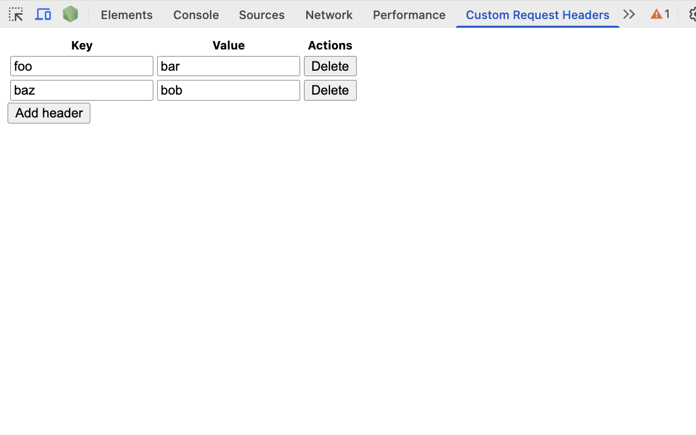

# Custom Request Headers Extension

https://chromewebstore.google.com/detail/custom-request-headers/keimeffkedoboaigicklcpffjlgcpoai

## Unpacked installation

1. `npm run build`
2. Load `dist` as unpacked extension
